<picture>
  <source media="(prefers-color-scheme: dark)" srcset="./dark.svg">
  <source media="(prefers-color-scheme: light)" srcset="./light.svg">
  
</picture>

# 👋 Hi, I'm Mahitha Katragadda

### B.Tech CSE (AI & ML) Student | Python Developer | AI & ML Enthusiast

 

---

# 👩‍💻 About Me

🎓 B.Tech CSE (AI & ML) student at **Anil Neerukonda Institute of Technology & Sciences (ANITS)**.

I enjoy building practical software that combines **Python**, **Machine Learning**, and **modern web technologies** to solve real-world problems.

- 🔭 **Currently Building:** Career AI Agent & DSA AI Learning Platform
- 🌱 **Currently Learning:** LLMs • RAG • FastAPI • AI Agents
- 🤝 **Interested In:** Open Source • AI Applications • Software Engineering
- 💬 **Ask Me About:** Python • Flask • Machine Learning
- 📍 **Location:** Visakhapatnam, Andhra Pradesh, India

---

# 💻 Tech Stack

### Languages

### Frameworks & Libraries

### Data Science & Machine Learning

### Development Tools

### Currently Exploring

---

# 🚀 Featured Projects

<b>🤖 DSA AI Learning Platform</b>

 

### Description

An AI-powered learning platform developed during my internship to help students strengthen **Data Structures & Algorithms** through adaptive learning and interview preparation.

### ✨ Key Features

- 📚 AI-assisted DSA Practice
- 💬 Technical Interview Mode
- 👥 HR Interview Practice
- 📊 Adaptive Question Levels
- 🎯 Topic-wise Learning (Stack, Queue, Linked List, Trees, Binary Search)
- 📄 Previous Year Questions

| Category | Details |
|-----------|---------|
| **Tech Stack** | Python, Flask, HTML, CSS, JavaScript, JSON |
| **Focus** | AI Learning Platform |
| **Role** | Full Stack Development |
| **Status** | 🚧 Active Development |

---

<b>🧠 Adaptive AI Quiz</b>

 

### Description

An intelligent quiz platform built for a hackathon that adapts question difficulty based on user performance to create a personalized learning experience.

### ✨ Key Features

- 📈 Adaptive Difficulty
- 🎯 Personalized Learning
- 📊 Performance Tracking
- ⚡ Dynamic Question Selection

| Category | Details |
|-----------|---------|
| **Tech Stack** | Python, Flask, HTML, CSS, JavaScript |
| **Focus** | Adaptive Learning |
| **Status** | ✅ Completed |

---

<b>🚀 Career AI Agent (In Progress)</b>

 

### Description

A career assistant that helps students prepare for internships by analyzing resumes, matching skills with job descriptions, and supporting interview preparation.

### ✨ Planned Features

- 📄 Resume Analysis
- 🤖 AI Career Guidance
- 🎯 Skill Gap Detection
- 💼 Job Description Matching
- ✍️ Resume Improvement Suggestions
- 📬 Internship Preparation

| Category | Details |
|-----------|---------|
| **Tech Stack** | Python, Flask, LLM APIs, JSON |
| **Focus** | Career Assistance |
| **Status** | 🚧 In Progress |

---

# 📊 GitHub Analytics

 

---

# 🐍 Contribution Graph

